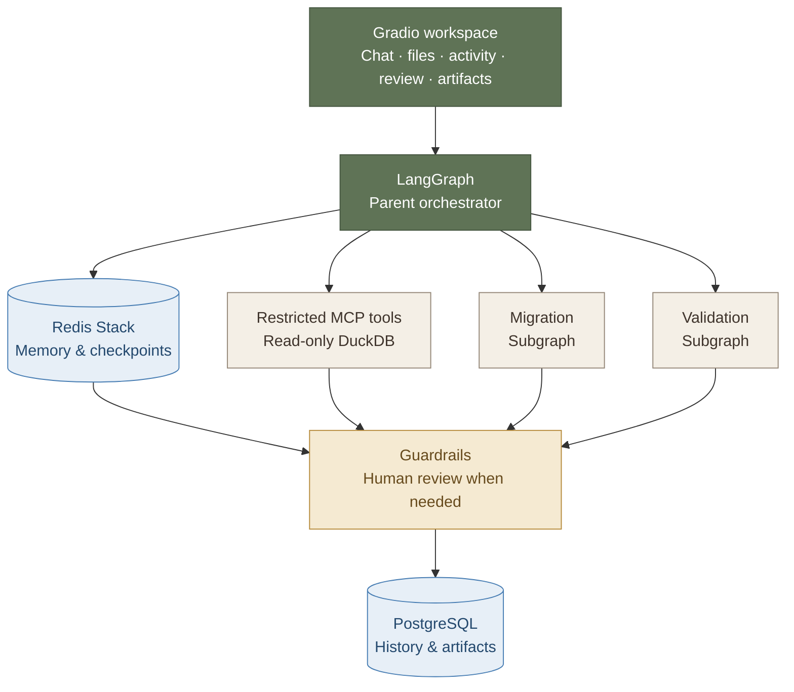

# SchemaShift

## 1. What is SchemaShift?

SchemaShift is a local-first Carnegie Mellon data-engineering capstone for migrating
read-only SQL from an old schema to a new schema. It uses only synthetic or explicitly
uploaded local data. It is not a cybersecurity tool and has no scanning, exploitation,
credential-access, cloud-model fallback, external-target, shell, arbitrary Python, or
unrestricted SQL capability.

The application combines a typed LangGraph parent orchestrator with isolated Migration
and Validation subgraphs. Its six runtime-discovered MCP v2 tools inspect registered
schemas, parse SQL, execute bounded read-only DuckDB queries, compare results, and read
confirmed local sources. PostgreSQL stores durable conversations and workflow history;
Redis Stack stores LangGraph checkpoints, semantic memory, and migration-document vectors.



Every meaningful event carries `conversation_id`, `session_id`, and `run_id`. A run that
needs judgment pauses through a durable LangGraph interrupt and can resume from a later UI
session without changing its run ID. SQL is written to the migrations directory only after
deterministic validation or explicit, eligible human approval; approved results with known
differences are labeled `human_approved`, never `validated`.

The checked-in benchmark definition contains exactly 50 deterministic cases: ten retail
schema-migration motifs across projection, filter, join, aggregate, and CTE/subquery forms.

## 2. Setup and Run Locally

### Prerequisites

- Python 3.11 (the project intentionally constrains Python to `>=3.11,<3.12`)
- [uv](https://docs.astral.sh/uv/)
- Docker with Docker Compose
- [Ollama](https://ollama.com/)

### Install the locked environment

```powershell
git clone <repository-url>
cd cmu-schemashift-agentic-capstone
Copy-Item .env.example .env
uv sync --locked
```

The defaults use local Ollama only. Pull both locked model names:

```powershell
ollama pull gpt-oss:20b
ollama pull bge-m3
```

For deterministic tests without model calls, set
`SCHEMASHIFT_MODEL_PROVIDER=mock`. There is no automatic cloud fallback.

### Start durable local services

```powershell
docker compose config
docker compose up -d
docker compose ps
```

The compose file pins PostgreSQL 17.10 and Redis Stack 7.4, enables Redis AOF, and uses
named volumes for both services.

### Initialize synthetic data and retrieval

These commands are idempotent:

```powershell
uv run python scripts/init_postgres.py
uv run python scripts/create_demo_data.py
uv run python scripts/ingest_knowledge.py
```

Accepted uploads are `.sql`, `.md`, `.json`, `.csv`, and `.parquet`, up to 25 MiB each.
The UI stages them under `data/generated/uploads/`, shows inferred roles for correction,
and does not index or build DuckDB data until those roles are confirmed.

### Verify the implementation

Run Ruff and the deterministic suite:

```powershell
uv run ruff check .
uv run pytest -m "not integration and not live"
uv run python scripts/run_benchmark.py --mode mock --arm both
```

Run local PostgreSQL and Redis integration tests after Compose is healthy:

```powershell
$env:SCHEMASHIFT_RUN_INTEGRATION="1"
uv run pytest tests/integration
```

Run one live Ollama case before the complete comparison:

```powershell
uv run python scripts/run_benchmark.py --mode live --arm both --case-id m01_projection --no-update-latest
```

The final acceptance comparison runs all 50 cases through both the prompt-only baseline
and the full workflow. Only this exact 100-arm live run may update
`benchmark/results/latest.json` and `benchmark/results/latest.md`:

```powershell
uv run python scripts/run_benchmark.py --mode live --arm both
```

### Start the application

```powershell
uv run python -m schemashift.ui.app
```

Open `http://127.0.0.1:7860`. The UI streams genuine backend activity for all seven
components (`mcp`, `memory`, `vector`, `agent`, `subagent`, `model`, and `guardrail`),
supports durable conversation reload and review resume, and exposes registered migration
artifacts for download.

After **View Migrated Files**, six inspection tabs expose the selected conversation:
**Context** shows inputs and the latest checkpoint; **Memory** shows the indexed knowledge
library, passages retrieved for the selected run, and learned facts and memory write decisions;
**Tools** lists discovered MCP tools and recorded calls;
**Graph** draws the compiled workflow locally; **Sub-Agent** shows Migration and
Validation briefings and results; **Trace** shows backend events and correlation IDs.
The panels refresh during runs and when reopening saved conversations. Unavailable
checkpoints or memory are labeled explicitly.

The **SQL Migration** panel is the normal starting point. Paste SQL into the editable
**Original SQL** editor or select **Import SQL** to register a `.sql` file through the
existing conversation/session-scoped upload service. Importing shows the filename and
populates the editor, but it does not start a migration; the text currently in the editor
is always what the next run uses. **Clear SQL** removes the current editor selection
without deleting the conversation or session. Source and target labels come from the
selected schema sources and database context.

For an ordinary migration, leave **Add migration instructions (optional)** collapsed and
select **Migrate SQL**. SchemaShift supplies its semantic-preservation objective itself.
Expand the optional field only for a special business rule, an explicit review request,
or a `Remember:` statement. Populated instructions travel with the parent run state and
the bounded Migration Sub-Agent briefing. A message entered in **Conversation** is copied
into this editable optional context for the next migration.


### Manual upload demos

[`demo/original/`](demo/original/) contains **23 SQL files** for the bundled synthetic
`customer_v1` to `customer_v2` migration: 10 original examples, 5 rejection candidates,
5 human-review candidates, and a 3-run memory demonstration. Files 11–15 deliberately
contain invalid source SQL or references; the others contain executable read-only queries.
Complete the synthetic-data and knowledge-index initialization above first. Use the
local Ollama provider for interactive demos; the mock provider alone does not generate
migrations for arbitrary uploaded SQL.

#### Run one example

1. Start a **New Conversation** in SchemaShift. For files 21–23, start one conversation
   for the entire sequence and keep using it.
2. In **SQL Migration**, select **Import SQL** and choose one `.sql` file from
   `demo/original/`. The compact imported-file indicator should show its filename.
3. Review or edit the query in **Original SQL**. Import does not run it. These query-only
   imports continue to use the existing demo schemas and databases.
4. For examples 01–09, leave **Add migration instructions (optional)** empty. For the
   rejection, review, and memory examples, expand it and use the specific text below.
   SQL comments explain each file's purpose, but comments alone do not save a memory or
   force review.
5. Select **Migrate SQL** and follow the activity indicators. If **Human
   Decision** requests a review, inspect the candidate and validation evidence
   before selecting **Approve**, **Reject**, or **Request changes**.
6. After a successful migration or eligible human approval, open **View Migrated Files**,
   select the resulting artifact, and download it. Rejected/unresolved examples should
   produce no artifact for that run.
   Use your browser's **Save As** option to save it under:

   `.\demo\migrated`

   Use the original filename with `.migrated.sql`, for example
   `01_table_rename.migrated.sql`, so you can compare the files side by side.
7. Start a new conversation for the next independent example. Keep the same conversation
   for the memory sequence.

Import one query per run. **Add Files** remains available for schema, data, and knowledge
uploads that need role confirmation; confirming several source SQL files there selects
the last confirmed query and does not run a batch migration.

The app stores its registered artifacts internally under
`data/generated/migrations/`. The `demo/migrated/` directory is the destination
for your manually saved downloads; creating these samples does not redirect
the app's artifact storage. It is initially empty so you can populate it during
the demonstration. A failed or unresolved run produces no SQL artifact.

#### Original examples: 01–10

| File | What to demonstrate |
| --- | --- |
| `01_table_rename.sql` | Rename the orders table while preserving repeated output rows. |
| `02_column_rename.sql` | Rename customer fields while keeping their original output aliases. |
| `03_order_totals_in_cents.sql` | Preserve exact cents totals when the new data stores decimal currency. |
| `04_signup_date_filter.sql` | Filter timestamps and retain the original text-date output type. |
| `05_active_status_lookup.sql` | Resolve descriptive status through a lookup join. |
| `06_customers_by_region.sql` | Resolve relocated attributes and preserve null groups. |
| `07_inactive_customer_business_rule.sql` | Reconstruct the activity flag using documented business rules in a CTE. |
| `08_order_primary_email.sql` | Join the correct contact without multiplying order rows or dropping null emails. |
| `09_customer_segment_nulls.sql` | Restore legacy null semantics when the new schema uses a default label. |
| `10_status_evidence_review.sql` | Surface conflicting status guidance for human review. |

For example 10, enter this under **Add migration instructions (optional)**:

> Compare the guidance in status_migration.md and status_conflict.md. If the
> status mappings conflict, request human review and show the alternatives.

Review is conditional on the retrieved evidence and model output, so it may
also appear in other examples. An artifact marked `human_approved` retains that
label and any known differences; human approval does not make those differences
validated.

#### Rejection candidates: 11–15

Use this optional instruction for each file:

> Check this source query against customer_v1 before migrating to customer_v2.
> Preserve the original query contract. Do not invent tables, columns, filter values,
> or grouping rules to repair an invalid source. If it cannot be validated, report
> the problem and produce no migration artifact.

| File | Deliberate problem | Expected observation |
| --- | --- | --- |
| [`11_reject_incomplete_filter.sql`](demo/original/11_reject_incomplete_filter.sql) | Missing value after `total_cents >`. | SQL parsing fails; preflight stops before model migration. |
| [`12_reject_broken_cte.sql`](demo/original/12_reject_broken_cte.sql) | Unclosed CTE and missing outer query. | SQL parsing fails; preflight stops before model migration. |
| [`13_reject_unknown_column.sql`](demo/original/13_reject_unknown_column.sql) | `customer.loyalty_points` does not exist. | Original execution fails; comparison cannot establish equivalence. |
| [`14_reject_unknown_table.sql`](demo/original/14_reject_unknown_table.sql) | `archived_orders` is not a registered demo table. | Original execution fails; substituting `orders` cannot validate the original. |
| [`15_reject_invalid_grouping.sql`](demo/original/15_reject_invalid_grouping.sql) | Ungrouped `customer_id` alongside `SUM(total_cents)`. | Original execution fails with a grouping error. |

Inspect **Tools → Tool calls and results**, **Sub-Agent → Validation**, and **Trace**
for the error. Files 11–12 finish as `unresolved` with no artifact. Files 13–15 can
consume the bounded revision budget before opening **Human Decision**. Approval must
remain unavailable because original execution failed. Select **Reject** to finish
unresolved. To ask the bounded workflow for another attempt, enter concrete feedback and
select **Request changes**. These are source-validation failures, not examples of a
reviewer overriding failed checks.

#### Human-review candidates: 16–20

These files contain valid original queries. Use the following optional instruction,
appending the review question from the table:

> Migrate this query to customer_v2 and preserve its original output contract.
> Human sign-off is required for the business-rule choice below, even if the synthetic
> result comparison passes. Mark the migration as requiring human review, show the
> candidate and alternatives, and pause for Human Decision before writing an artifact.

| File | Append this review question | What the reviewer should check |
| --- | --- | --- |
| [`16_review_pending_status.sql`](demo/original/16_review_pending_status.sql) | Compare `status_migration.md` and `status_conflict.md`: should Pending use code `P` or the superseded `I`? | Legacy Pending is customer **3**; `I` selects customer **2**. Inspect which documents were actually retrieved. |
| [`17_review_primary_contact.sql`](demo/original/17_review_primary_contact.sql) | Using `contact_migration.md`, should the join select primary email only or any primary contact? | Preserve **6 customers**, one null email, and one row per customer. Filter both `contact_type = 'email'` and `is_primary` in a left join. |
| [`18_review_null_segment.sql`](demo/original/18_review_null_segment.sql) | Using `profile_defaults.md`, should missing segments remain SQL null or become the visible label `UNKNOWN`? | Preserve customers **3 and 6** and their null output values; the target stores a sentinel. |
| [`19_review_unmatched_order_state.sql`](demo/original/19_review_unmatched_order_state.sql) | Inspect the paired order data and `order_migration.md`: how should unmatched code `X` retain the legacy `Manual` description? Do not silently drop the order or invent a general fallback. | Preserve order **109**, whose target code has no lookup row. Review an explicit `X` to `Manual` mapping; an inner lookup join loses it. |
| [`20_review_active_business_rule.sql`](demo/original/20_review_active_business_rule.sql) | Using `customer_active_rule.md`, should activity come from `account_state = 'OPEN'` or the status lookup flag? Require business-owner sign-off on the rule. | Legacy inactive customers are **2, 3, and 5**. The documentation defines activity by account state; equal results on this small fixture do not establish the general business rule. |

In **Memory → Used in this run**, inspect the retrieved passages; in **Human Decision**,
inspect the candidate, alternatives, validation, and known differences. Approve only
after reviewing the decision and when approval is enabled. An approved artifact is
`human_approved`; its approved mappings may also be written to learned memory. To show
rejection of an otherwise executable proposal, select **Reject**. To demonstrate a
correction instead, enter specific mapping feedback and select **Request changes**.

Review is **conditional on the model's review flags, confidence, retrieved evidence,
and validation**. A filename or comment does not force an interrupt. If a run completes
automatically, it has not demonstrated the review gate: use a fresh conversation and
repeat the explicit sign-off request. Missing retrieved documents can be confirmed
through **Add Files** and checked under **Memory**, but retrieval still selects a subset.
Do not describe an automatically validated result as human-reviewed.

#### Memory persistence and recall: 21 → 22 → 23

Keep Redis and PostgreSQL running. Start a **New Conversation once**, then import one
file at a time. Learned memory is stored for that conversation; a new
conversation is not expected to recall these records.

1. **Persist a preference:** import
   [`21_memory_remember_order_contract.sql`](demo/original/21_memory_remember_order_contract.sql).
   Enter this exact optional instruction, starting with `Remember:`:

   > Remember: Retail order exports retain repeated customer IDs and integer cents under the legacy total_cents column name.

   After successful automatic validation, open **Memory → Learned memory → Memory write
   decisions**. Verify `stored: true`, `memory_type: user_preference`, and the saved text.
   Record its `memory_id` and provenance `run_id`. The original returns **9 orders**.
   Reflection runs after migration succeeds; an unresolved run does not save this preference.
   If this run instead needs human approval, approval stores mappings in preference to
   the `Remember:` instruction. Repeat file 21 and its exact instruction in the same conversation
   after resolving that review, and verify the `user_preference` before continuing.

2. **Recall without restating it:** in the **same conversation**, import
   [`22_memory_recall_order_contract.sql`](demo/original/22_memory_recall_order_contract.sql).
   Use:

   > Migrate this filtered retail order export using the preferences already saved for this conversation.

   In **Memory → Learned memory**, verify that the recalled record has the saved
   `memory_id` and source run ID from step 1. The original returns **6 orders**;
   customer IDs **1 and 4** repeat. Check the migrated result preserves the cents
   values and legacy column names. This request should not create a new preference.

3. **Recall after restart:** stop the SchemaShift application with **Ctrl+C** and
   restart it with `uv run python -m schemashift.ui.app`. Leave Redis/PostgreSQL and
   their volumes intact. In **Conversation history**, reopen the conversation from
   steps 1–2; do not use the newly created empty conversation. Import
   [`23_memory_recall_after_restart.sql`](demo/original/23_memory_recall_after_restart.sql)
   and use:

   > Migrate this aggregated retail order export using the preferences already saved for this conversation.

   Verify the same saved record is recalled under **Memory → Learned memory**, with its
   original provenance. **Context** should show the same conversation ID and a new
   session/run ID. The original returns **6 customer totals**. Recalling the original
   record in this later session demonstrates persistence beyond the application process.

Recall occurs before reflection, so a newly written preference normally appears under
**Memory write decisions** in step 1 and among recalled facts in steps 2–3. A correct
migration alone is not proof of memory use: the indexed knowledge documents also explain
cents conversion. Verify the recalled record and provenance, not just the SQL output.
If memory is unavailable, restore the local services before demonstrating persistence;
if the preference is missing, check the step-1 write, conversation ID, and retrieval results.
