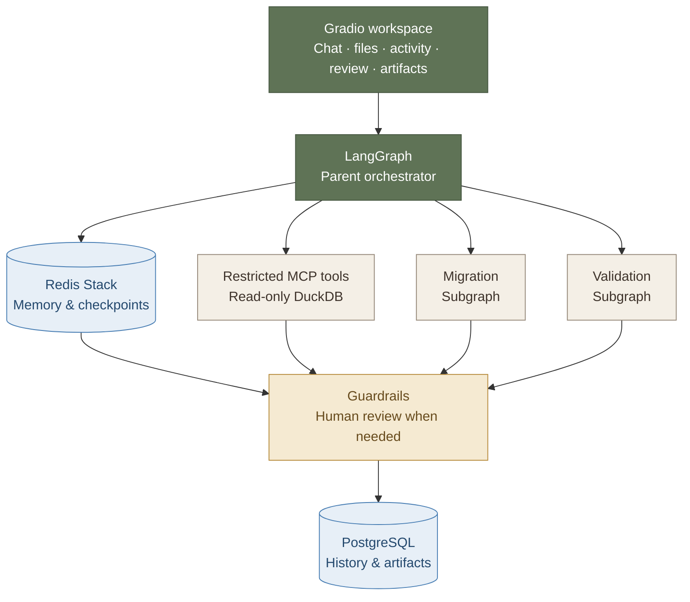

# SchemaShift

## 1. What is SchemaShift?

SchemaShift is a local-first Carnegie Mellon data-engineering capstone for migrating
read-only SQL from an old schema to a new schema. It uses only synthetic or explicitly
uploaded local data. It is not a cybersecurity tool and has no scanning, exploitation,
credential-access, cloud-model fallback, external-target, shell, arbitrary Python, or
unrestricted SQL capability.

The application combines a typed LangGraph parent orchestrator with isolated Migration
and Validation subgraphs. Its six runtime-discovered MCP v2 tools inspect registered
schemas, parse SQL, execute bounded read-only DuckDB queries, compare results, and read
confirmed local sources. PostgreSQL stores durable conversations and workflow history;
Redis Stack stores LangGraph checkpoints, semantic memory, and migration-document vectors.



Every meaningful event carries `conversation_id`, `session_id`, and `run_id`. A run that
needs judgment pauses through a durable LangGraph interrupt and can resume from a later UI
session without changing its run ID. SQL is written to the migrations directory only after
deterministic validation or explicit, eligible human approval; approved results with known
differences are labeled `human_approved`, never `validated`.

The checked-in benchmark definition contains exactly 50 deterministic cases: ten retail
schema-migration motifs across projection, filter, join, aggregate, and CTE/subquery forms.

## 2. Setup and Run Locally

### Prerequisites

- Python 3.11 (the project intentionally constrains Python to `>=3.11,<3.12`)
- [uv](https://docs.astral.sh/uv/)
- Docker with Docker Compose
- [Ollama](https://ollama.com/)

### Install the locked environment

```powershell
git clone <repository-url>
cd cmu-schemashift-agentic-capstone
Copy-Item .env.example .env
uv sync --locked
```

The defaults use local Ollama only. Pull both locked model names:

```powershell
ollama pull gpt-oss:20b
ollama pull bge-m3
```

For deterministic tests without model calls, set
`SCHEMASHIFT_MODEL_PROVIDER=mock`. There is no automatic cloud fallback.

### Start durable local services

```powershell
docker compose config
docker compose up -d
docker compose ps
```

The compose file pins PostgreSQL 17.10 and Redis Stack 7.4, enables Redis AOF, and uses
named volumes for both services.

### Initialize synthetic data and retrieval

These commands are idempotent:

```powershell
uv run python scripts/init_postgres.py
uv run python scripts/create_demo_data.py
uv run python scripts/ingest_knowledge.py
```

Accepted uploads are `.sql`, `.md`, `.json`, `.csv`, and `.parquet`, up to 25 MiB each.
The UI stages them under `data/generated/uploads/`, shows inferred roles for correction,
and does not index or build DuckDB data until those roles are confirmed.

### Verify the implementation

Run Ruff and the deterministic suite:

```powershell
uv run ruff check .
uv run pytest -m "not integration and not live"
uv run python scripts/run_benchmark.py --mode mock --arm both
```

Run local PostgreSQL and Redis integration tests after Compose is healthy:

```powershell
$env:SCHEMASHIFT_RUN_INTEGRATION="1"
uv run pytest tests/integration
```

Run one live Ollama case before the complete comparison:

```powershell
uv run python scripts/run_benchmark.py --mode live --arm both --case-id m01_projection --no-update-latest
```

The final acceptance comparison runs all 50 cases through both the prompt-only baseline
and the full workflow. Only this exact 100-arm live run may update
`benchmark/results/latest.json` and `benchmark/results/latest.md`:

```powershell
uv run python scripts/run_benchmark.py --mode live --arm both
```

### Start the application

```powershell
uv run python -m schemashift.ui.app
```

Open `http://127.0.0.1:7860`. The UI streams genuine backend activity for all seven
components (`mcp`, `memory`, `vector`, `agent`, `subagent`, `model`, and `guardrail`),
supports durable conversation reload and review resume, and exposes registered migration
artifacts for download.

After **View Migrated Files**, six inspection tabs expose the selected conversation:
**Context** shows inputs and the latest checkpoint; **Memory** shows recalled facts
and memory write decisions; **Tools** lists discovered MCP tools and recorded calls;
**Graph** draws the compiled workflow locally; **Subagent** shows Migration and
Validation briefings and results; **Trace** shows backend events and correlation IDs.
The panels refresh during runs and when reopening saved conversations. Unavailable
checkpoints or memory are labeled explicitly.


# Manual upload demo

`original/` contains exactly 10 SQL files for the bundled synthetic
`customer_v1` to `customer_v2` migration. Each file contains one read-only query.
Use the initialized demo databases and indexed migration documents described
in the project README.

## Run one example

1. Start a **New Conversation** in SchemaShift.
2. Open **Add Files** and upload one `.sql` file from `demo/original/`.
3. Confirm that its role is `source_sql`, then select **Confirm roles and ingest**.
   These query-only uploads use the existing demo schemas and databases.
4. Return to **Chat**. Check that **Original SELECT SQL** contains the uploaded
   query, then enter:

   > Migrate this query to customer_v2. Preserve the output column names, types,
   > nulls, duplicate rows, and business meaning. Use the migration documents
   > and validate the results against the original query.

5. Select **Migrate SQL** and follow the activity indicators. If **Human
   Decision** requests a review, inspect the candidate and validation evidence
   before approving or rejecting it.
6. Open **View Migrated Files**, select the resulting artifact, and download it.
   Use your browser's **Save As** option to save it under:

   `.\demo\migrated`

   Use the original filename with `.migrated.sql`, for example
   `01_table_rename.migrated.sql`, so you can compare the files side by side.
7. Start a new conversation for the next example.

Upload one query per run: confirming several SQL files together selects the
last confirmed query; it does not run a batch migration.

The app stores its registered artifacts internally under
`data/generated/migrations/`. The `demo/migrated/` directory is the destination
for your manually saved downloads; creating these samples does not redirect
the app's artifact storage. It is initially empty so you can populate it during
the demonstration. A failed or unresolved run produces no SQL artifact.

## Examples

| File | What to demonstrate |
| --- | --- |
| `01_table_rename.sql` | Rename the orders table while preserving repeated output rows. |
| `02_column_rename.sql` | Rename customer fields while keeping their original output aliases. |
| `03_order_totals_in_cents.sql` | Preserve exact cents totals when the new data stores decimal currency. |
| `04_signup_date_filter.sql` | Filter timestamps and retain the original text-date output type. |
| `05_active_status_lookup.sql` | Resolve descriptive status through a lookup join. |
| `06_customers_by_region.sql` | Resolve relocated attributes and preserve null groups. |
| `07_inactive_customer_business_rule.sql` | Reconstruct the activity flag using documented business rules in a CTE. |
| `08_order_primary_email.sql` | Join the correct contact without multiplying order rows or dropping null emails. |
| `09_customer_segment_nulls.sql` | Restore legacy null semantics when the new schema uses a default label. |
| `10_status_evidence_review.sql` | Surface conflicting status guidance for human review. |

For example 10, append this to the migration request:

> Compare the guidance in status_migration.md and status_conflict.md. If the
> status mappings conflict, request human review and show the alternatives.

Review is conditional on the retrieved evidence and model output, so it may
also appear in other examples. An artifact marked `human_approved` retains that
label and any known differences; human approval does not make those differences
validated.
